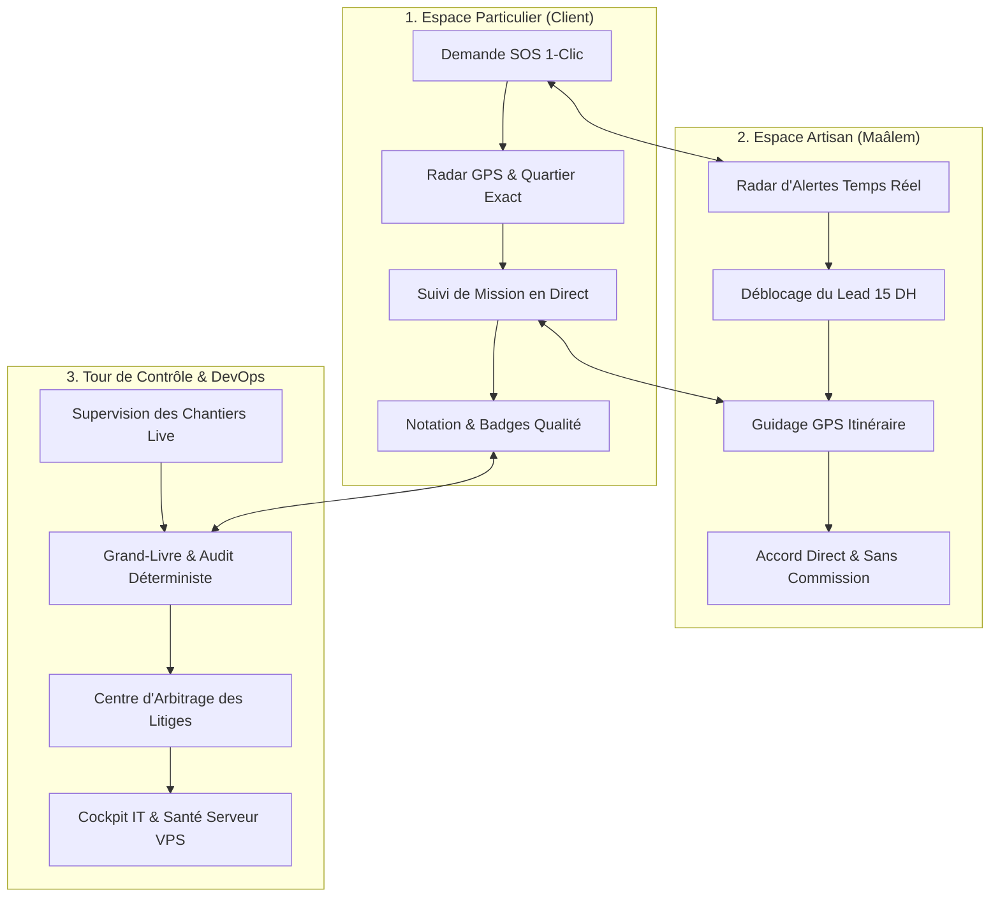

<div align="center">

# 🇲🇦 BricoleMoi • بريكول موال

**La Plateforme Souveraine de Dépannage d'Urgence & Services à Domicile au Maroc**

[](https://bricolemoi.vercel.app)
[](https://pocketbase.51.255.46.206.sslip.io/_/)
[](http://51.255.46.206:8800)
[](https://bricolemoi.vercel.app)
[](LICENSE)

[🌐 Explorer la Plateforme en Direct](https://bricolemoi.vercel.app) • [🛠️ Console DevOps IT](https://bricolemoi.vercel.app/it) • [🛡️ Tour de Contrôle Admin](https://bricolemoi.vercel.app/admin)

<br/>

</div>

---

## 📖 Vision & Présentation

**BricoleMoi** est une Progressive Web App (PWA) de mise en relation instantanée entre les particuliers marocains en situation d'urgence domestique (plomberie, électricité, serrurerie, climatisation, électroménager) et les artisans qualifiés (**Maâlems**) les plus proches.

Conçue selon les standards **Modern Clean & Trust** et adaptée aux réalités du terrain marocain, BricoleMoi repose sur une architecture souveraine hébergée sur VPS dédié OVH (PocketBase + Centrifugo + MapLibre GL).

---

## 🏛️ Les 3 Piliers Indissociables



### 1. 👤 Côté Particulier (Client)
* **Demande SOS en 2 étapes** : Sélection du métier, détection GPS 1-clic du quartier exact (Casablanca, Fès, Rabat, Marrakech, Tanger, Agadir).
* **100% Gratuit & Zéro Commission** : Le client ne paie aucun frais d'intermédiation.
* **Tarification Accord Direct** : Prix convenu librement entre le client et l'artisan sur place après diagnostic.
* **Preuve Sociale & Badges d'Excellence** : Système d'évaluation 1-5 étoiles avec badges vérifiés (*⏱️ Très Ponctuel*, *💎 Travail Soigné*, *🤝 Maâlem de Confiance*).

### 2. 🛠️ Côté Artisan (Maâlem)
* **Radar d'Alertes Instantané** : Réception des missions d'urgence par WebSockets haute fréquence (Centrifugo v5).
* **Déblocage Équitable (15 DH)** : Consultation du contact client sans ponction sur le chiffre d'affaires du chantier.
* **Gestion du Portefeuille & Packs** : Recharges transparentes, suivi du solde de leads et historique comptable.
* **Guidage GPS précis** : Positionnement au quartier près, sans replis arbitraires.

### 3. 🛡️ Côté Administration & Cockpit DevOps
* **Supervision Temps Réel** : Cartographie des chantiers actifs et des artisans en ligne.
* **Audit Déterministe & Anti-Fraude** : Contrôle de cohérence automatique des profils, transactions et missions.
* **Répertoire Nettoyé** : Déduplication stricte par téléphone, étanchéité absolue entre clients et administrateurs.
* **Grand-Livre Comptable Dynamique** : Traçabilité au centime près de chaque transaction sur PocketBase SQLite WAL.

---

## ⚡ Stack Technologique Souveraine

| Composant | Technologie | Rôle dans BricoleMoi |
| :--- | :--- | :--- |
| **Frontend UI** | **React 18 + Vite** | PWA ultra-rapide, bundle scindé par rôle |
| **Design System** | **Tailwind CSS + Framer Motion** | Charte *Modern Clean & Trust*, micro-animations |
| **Cartographie** | **MapLibre GL + CartoDB Positron** | Rendu vectoriel fluide sans dépendance Google Maps |
| **Base de Données** | **PocketBase VPS (Go / SQLite WAL)** | Moteur souverain, SSL Let's Encrypt, latence < 60ms |
| **Moteur Temps Réel**| **Centrifugo Engine v5** | WebSocket haute performance pour le radar d'alertes |
| **Stockage Médias** | **Cloudflare R2** | Photos de chantiers et justificatifs CIN chiffrés |
| **Passerelle WhatsApp**| **Evolution API VPS** | Notifications instantanées et codes de validation |
| **Observabilité** | **Beszel Hub v0.8.0** | Monitoring CPU 4 vCores, RAM 8 Go et stockage NVMe |

---

## 📐 Règles d'Ingénierie Clés (*Modern Clean & Trust*)

1. **Zéro Donnée Forcée** : Aucun tarif imposé, aucune fausse photo d'Unsplash, aucun repli géographique arbitraire.
2. **Identifiants Natifs 15 Caractères** : Standard `[a-z0-9]{15}` PocketBase strict sur l'ensemble du cycle de vie des données (`profiles`, `interventions`, `transactions`).
3. **Mobile-First Garanti** : Cibles tactiles d'au moins 44px, tiroir de navigation ergonomique (*Drawer*), zéro débordement horizontal.
4. **Comptabilité Juste** : Le solde du Grand-Livre est calculé dynamiquement par agrégation temps réel de la collection `transactions`.

---

## 🚀 Démarrage Rapide en Local

### Prérequis
* **Node.js** >= 18.x
* **npm** >= 9.x

### Installation

```bash
# 1. Cloner le dépôt
git clone https://github.com/Ab-Ly/bricolemoi.git
cd bricolemoi

# 2. Installer les dépendances
npm install

# 3. Lancer le serveur de développement local
npm run dev
```

L'application est immédiatement accessible sur `http://localhost:5173`.

### Commandes Utiles

```bash
# Lancer le listener temps réel (PocketBase + Centrifugo)
npm run listen

# Vérifier la santé du VPS PocketBase en direct (CLI)
npm run pocketbase:status

# Lancer la suite de tests unitaires
npm test

# Compiler pour la production
npm run build
```

---

## 🗺️ Organisation des Vues & Sous-Domaines

| URL / Rôle | Vue Associée | Description |
| :--- | :--- | :--- |
| **`/`** *(ou sous-domaine client)* | `ClientApp.jsx` | Accueil, recherche d'artisans et entonnoir SOS |
| **`/pro`** *(ou maalem.*)* | `MaalemApp.jsx` | Tableau de bord artisan, radar de leads et solde |
| **`/admin`** | `AdminApp.jsx` | Tour de contrôle, répertoire clients, litiges |
| **`/it`** | `ITApp.jsx` | Cockpit IT, observabilité serveur, trousseau devops |

---

<div align="center">

**Conçu avec passion pour les artisans et les foyers du Maroc 🇲🇦**

*BricoleMoi © 2026 • Tous droits réservés.*

</div>
